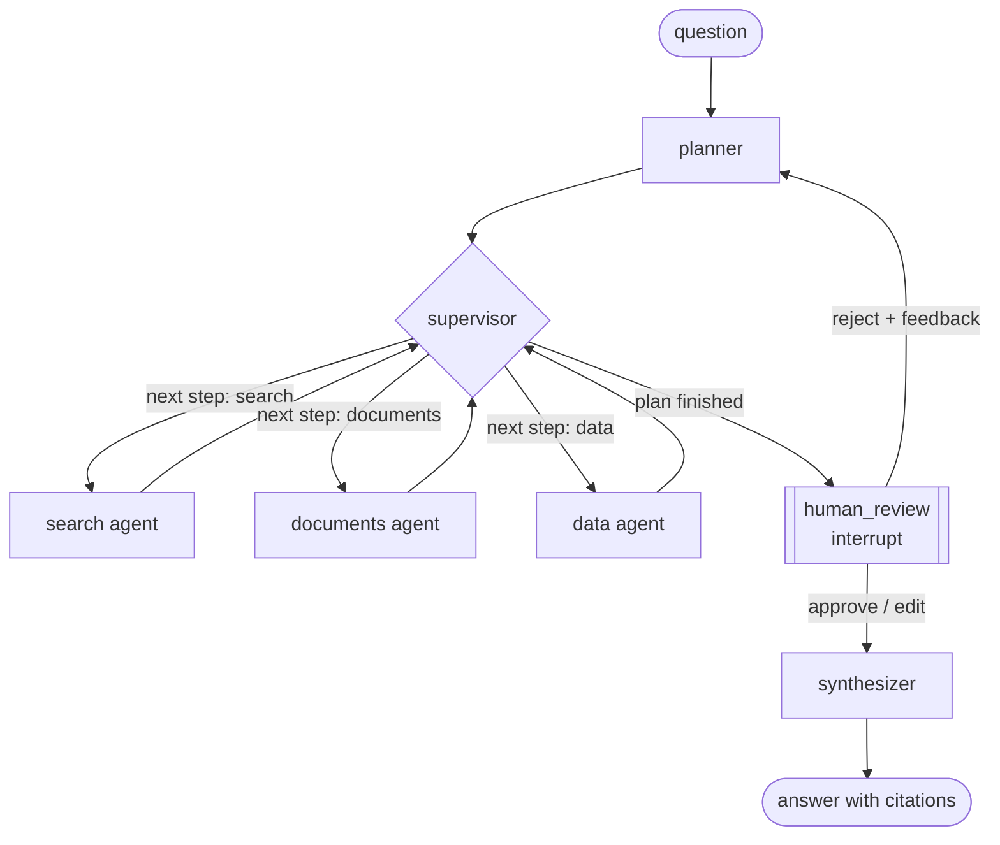

# Architecture

## The graph

State lives in one `ResearchState` dict: the question, the plan, a step pointer, the evidence list, the agents' notes, reviewer feedback, and the answer. LangGraph checkpoints it after every node into PostgreSQL (`AsyncPostgresSaver`), keyed by a thread id.

The supervisor is code, not a model call. It reads `plan[step_index]` and hands control to that specialist; when the plan is used up it goes to review. The planner decides what to do and the supervisor decides only when. At startup the runtime builds a catalog of what each source holds (document titles, table columns and year range, web fixture scope) from the live tools, and the planner gets it in its system prompt.

## Agents and their contracts

| Agent | Input | Tools | Output |
|---|---|---|---|
| planner | question, source catalog, reviewer feedback if any, notes so far | none; structured output (JSON schema) | 1 to 4 steps, each `{agent, instruction}` |
| search | question and one instruction | `web_search`, `read_article`, `wikipedia_search`, `wikipedia_page` | a short note citing evidence ids, plus new evidence |
| documents | question and one instruction | `list_docs`, `search_docs`, `read_doc` (MCP), `paper_search` (Qdrant) | same |
| data | question and one instruction | `list_tables`, `describe_table`, `run_sql` (MCP) | same |
| synthesizer | question, all evidence, notes, reviewer instruction | none | an answer where every claim carries `[E#]` citations |

Every tool call that returns content becomes one or more evidence items with a stable id (`E1`, `E2`, ...), a source type, a title, a URL and the text. Ids are assigned after a turn's tool calls finish, in call order, so parallel calls still number deterministically. The synthesizer sees the full text of every item, and the eval checks each citation against the item it names.

The three specialists share one loop (`agents.run_specialist`): at most five model turns, parallel tool calls in a turn, tool errors returned to the model as `is_error` results rather than raised, and tool use disabled on the last turn so the agent always ends with a written note.

## The five sources

| # | Source | How agents reach it | Why this form |
|---|---|---|---|
| 1 | 30 EIA "Energy Explained" pages as markdown | MCP server, `search_docs` / `read_doc` (BM25 over sections) | Reference text an agent needs to read, not just match |
| 2 | Our World in Data energy table in SQLite, 7,636 rows | MCP server, `run_sql` (read-only connection) | Numbers should come from a query, not a paragraph |
| 3 | Web search | `web_search`: a committed snapshot of 40 EIA "Today in Energy" articles by default, DuckDuckGo with `WEB_SEARCH_BACKEND=duckduckgo` | A fixed fixture keeps the eval reproducible |
| 4 | Wikipedia | live API | Background and definitions |
| 5 | 242 arXiv abstracts | Qdrant, embedded with `BAAI/bge-small-en-v1.5` | Research questions are phrased differently from paper titles, so this one is semantic search |

The MCP server (`orchestrator.mcp_server`) runs as a subprocess over stdio. Because it is an ordinary MCP server, the same docs and database tools work from any MCP host without this repo's agents.

## Decisions

**Supervisor over swarm.** In a swarm, agents hand off to each other directly and the route emerges from their choices. That is flexible, but hard to test and hard to bound: any agent can loop back to any other. Here the planner commits to a short plan, and a deterministic supervisor walks it. The route is then a data structure I can show a reviewer, assert on in tests (`test_supervisor_routes_plan_steps_in_order_then_to_review`) and cap (four steps, five turns each, two replans). The cost is that the system cannot improvise mid-run. If the data agent finds something that calls for a Wikipedia lookup, nothing reacts until a human rejects the plan.

**Interrupts for human review.** The review step calls LangGraph's `interrupt()`, which checkpoints the state and returns control to the caller. A person can approve, drop evidence items, give the writer an instruction, or reject with feedback, which sends the run back to the planner. Because the checkpoint is in PostgreSQL, the reviewer does not have to be in the same process or on the same day: `orchestrator ask` can quit at the review prompt and `orchestrator resume <thread>` picks it up later. The alternatives were a blocking `input()` inside a node, which ties the run to one terminal, or a separate approval service, which is more infrastructure than the problem needs. Review sits before synthesis rather than before each tool call because the useful question for a person is "is this the right evidence", not "may the agent run this search".

**Qdrant over pgvector.** PostgreSQL is already in the stack, so pgvector would mean one fewer service, and for 242 abstracts it would be plenty. I used Qdrant for two reasons. It keeps the vector index separate from run state, so re-indexing the corpus never touches checkpoints or run records. And it has payload filtering and quantization built in, which matter once the corpus grows past what a single Postgres instance should hold alongside transactional data. If the corpus stayed this small I would switch to pgvector.

**The planner does not pick tools.** It picks agents. Each agent owns a small tool set (three or four tools), which keeps tool definitions short and makes each agent's mistakes easier to find.

**Evidence ids, not free-form citations.** The model cannot invent a URL; it can only cite an id that exists. That makes citation validity checkable in code, and leaves only support ("does E4 actually say this?") to the judge.

**One model per role, set by environment variable.** Retrieval agents mostly read and call tools; synthesis is the step where quality matters most. Separate settings let the eval price each role.

**Tracing.** `ORCH_TRACING=otel` wraps every node, model call and tool call in an OpenTelemetry span with token counts and cost. Spans go to any OTLP endpoint (LangSmith, Langfuse, Jaeger, Honeycomb) when `OTEL_EXPORTER_OTLP_ENDPOINT` is set, and to the console otherwise.

## What I would change

- **Run independent steps in parallel.** The supervisor runs steps one after another even when they do not depend on each other. LangGraph's `Send` could fan them out and roughly halve latency for three-source questions.
- **Give the web agent a live index.** The fixture holds only U.S.-focused EIA articles, so questions about other countries get irrelevant web results. A real search API with a recorded cache for the eval would fix that.
- **Let specialists pick their own sources.** The planner now sees a catalog of what each source contains, which helped fix four run-1 failures, but it also started naming sources in its instructions and once sent a question about a 2026 wind farm to Wikipedia instead of the newer web article. Instructions should say what to find, not where.
- **Trim evidence before synthesis.** The synthesizer reads every evidence item in full, which is its biggest cost. Dropping items no agent note cites, or reranking them, would cut that without hiding anything the notes relied on.
- **Let the supervisor react.** A cheap check after each step ("did this step find what it was asked for?") could trigger one targeted follow-up without waiting for a human rejection.
- **Replace the in-repo judge with a held-out one.** The same model family writes and grades the answers. Spot-checking a sample by hand, or grading with a different model family, would make the relevance number more trustworthy.
