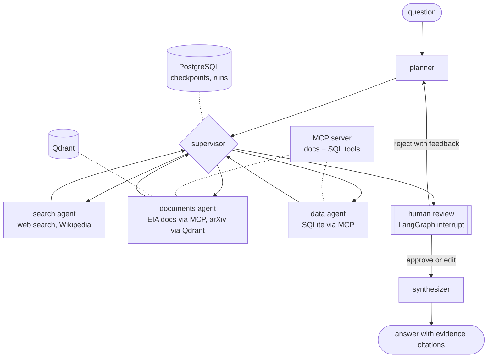

# multi-agent-research-orchestrator

Five LangGraph agents that plan, search, retrieve and synthesize answers across five data sources, with a human review step before the answer is written and an eval harness that scores relevance and citation accuracy.

## Problem

Questions worth asking a research assistant usually need more than one source: a number from a database, an explanation from reference docs, a recent development from the news, context from an encyclopedia, a pointer into the research literature. A single RAG call over one index does not cover that, and an agent that answers without showing where each claim came from is hard to trust. This project splits the work across specialist agents with narrow tool sets, makes every retrieved item a citable piece of evidence, lets a person inspect and edit that evidence before the answer is written, and measures the result.

The domain is energy, because it has public sources of every kind: EIA reference pages and articles (U.S. government work, public domain), Our World in Data statistics (CC BY 4.0), arXiv abstracts (CC0 metadata) and Wikipedia.

## Architecture



The planner writes a short plan (one to four steps, each naming a specialist). The supervisor walks it. Each specialist runs a small tool loop and returns a note plus evidence items with ids like `E4`. Before synthesis the graph interrupts: a person approves, drops evidence items, adds an instruction for the writer, or rejects the research with feedback, which sends it back to the planner. The synthesizer may only cite evidence ids. State is checkpointed to PostgreSQL after every step, so a run paused for review can be resumed later from another process.

| Source | Contents | Reached through |
|---|---|---|
| Markdown docs | 30 EIA "Energy Explained" pages | MCP server (`search_docs`, `read_doc`) |
| SQLite | Our World in Data energy table, 7,636 country-year rows from 2000 | MCP server (`run_sql`, read-only) |
| Web search | 40 EIA "Today in Energy" articles (fixture), or live DuckDuckGo | local tool; `WEB_SEARCH_BACKEND` |
| Wikipedia | live API | local tool |
| Vector store | 242 arXiv abstracts, `bge-small-en-v1.5` embeddings | Qdrant |

ARCHITECTURE.md has each agent's contract and the reasoning behind the design.

## Quickstart

Needs Docker and an Anthropic API key.

```bash
git clone https://github.com/armaanwaels/multi-agent-research-orchestrator.git
cd multi-agent-research-orchestrator
echo "ANTHROPIC_API_KEY=sk-ant-..." > .env
docker compose up -d        # Qdrant, PostgreSQL, and a one-shot seed job
docker compose run --rm app ask "How did Germany's coal share of electricity change between 2015 and 2025?"
```

The image builds in about 30 seconds on a laptop with a warm Docker cache, and seeding takes about 30 more. `ask` stops at the review step and shows the plan, the agents' notes and every evidence item:

```
[a]pprove  [e]dit  [r]eject  [q]uit and resume later >
```

Quitting leaves the run in PostgreSQL. `docker compose run --rm app resume <thread-id>` continues it, and `docker compose run --rm app runs` lists recent runs with their cost.

Without Docker, with Python 3.11 and uv:

```bash
docker compose up -d qdrant postgres
uv sync
uv run orchestrator seed
uv run orchestrator ask "..."        # add --auto-approve to skip review
uv run pytest
```

Models are set per role with `ORCH_PLANNER_MODEL`, `ORCH_WORKER_MODEL`, `ORCH_SYNTH_MODEL` and `ORCH_JUDGE_MODEL`, all defaulting to `claude-opus-5`. Set `ORCH_TRACING=otel` to emit OpenTelemetry spans for every node, model call and tool call (with `OTEL_EXPORTER_OTLP_ENDPOINT` to send them to LangSmith, Langfuse, Jaeger or any OTLP collector).

## Evaluation

Produced by this command on September 21, 2026, at the commit tagged `eval-2026-09-21`:

```bash
ORCH_PLANNER_MODEL=claude-sonnet-5 ORCH_WORKER_MODEL=claude-sonnet-5 \
ORCH_SYNTH_MODEL=claude-sonnet-5 ORCH_JUDGE_MODEL=claude-sonnet-5 \
uv run python evals/run_eval.py --budget 5.5
```

32 tasks, all completed. Human review was auto-approved and web search used the fixture. Full output is in `results/eval_summary.md` (table) and `results/eval_results.jsonl` (every answer, plan, judge rationale and cost).

| Metric | Result |
|---|---|
| Relevance: tasks the judge scored 4 or 5 out of 5 | 78% (25/32) |
| Relevance: mean judge score | 4.28 / 5 |
| Citation accuracy: citations whose evidence supports the sentence | 92% (258/281) |
| Citations to evidence ids that do not exist | 0 |
| Tasks where the agents used every source type the task needs | 28/32 |
| Median time per task | 27 s |
| Cost: system / judge / total | $2.00 / $0.83 / $2.83 |

**How the tasks were made.** The 32 questions and reference answers in `evals/tasks.yaml` were written by Claude Code, the agent that built this repo, from the committed source snapshots. 22 need two or more source types. Every database number in a reference is listed with the SQL that produces it, and `uv run python evals/check_tasks.py` reruns all 43 checks (CI runs it too). I did not review each reference by hand, and one turned out to be wrong (below).

**How they are scored.** An LLM judge grades each answer against its reference on a 1-5 rubric (`evals/judge.py`). Citations are checked in two steps: code confirms the cited id exists, then the judge decides whether the cited evidence supports the sentence. The judge is the same model family as the system, which is a known source of bias.

**The seven tasks that scored 3 or lower:**

| Task | Score | Cause |
|---|---|---|
| t06 China nuclear, t20 India solar, t27 U.S. generation | 3, 2, 2 | The data agent filtered to years up to 2023 and reported that later data did not exist. The table runs to 2025. Nothing told the agent the year range. |
| t11 geothermal | 2 | The planner sent only the search agent. The EIA page with the answer was never read. |
| t22 Puerto Rico | 3 | The fact was past the 1,200-character cut-off of web search snippets, and the agent has no tool to open the full article. |
| t16 offshore wind forecasting | 3 | Correct but less specific than the reference about which methods papers use. |
| t19 LNG and gas uses | 3 | My reference was wrong. It took EIA's section heading ("electricity generation and space heating"), but the page's own numbers make industry the second-largest use, which is what the system said. |

With the default models (Opus 5 for every role), a two-task pilot scored 5 on both tasks at about $0.42 per task including the judge (`uv run python evals/run_eval.py --ids t05-sunzia t10-hydrogen --out pilot`, results in `results/pilot_summary.md`). Two tasks say little about quality; the full run used Sonnet 5 to stay inside a $5 budget.

## Decisions and tradeoffs

- **A plan walked by a deterministic supervisor, not agents handing off to each other.** The route is inspectable, testable and bounded (four steps, five turns per agent, two replans). The cost is that nothing reacts mid-run when one agent's findings call for another lookup.
- **Review before synthesis, not before each tool call.** The question a person can usefully answer is "is this the right evidence", and it is asked once per run. Interrupts plus PostgreSQL checkpoints mean the reviewer does not need to be in the same process.
- **Evidence ids instead of free-form citations.** The writer cannot cite anything that was not retrieved, which makes citation validity checkable in code and leaves only "does this evidence support this claim" to the judge.
- **MCP for docs and SQL.** Those tools run as a separate MCP server over stdio, so they also work from any MCP host, and the agents do not import the data layer.
- **A web fixture by default.** The eval must not change when the web does. The live backend is one environment variable away.
- **Qdrant over pgvector.** It keeps the vector index apart from run state. At 242 abstracts pgvector would be enough, and it would remove a service.

## What went wrong / limitations

- **The data agent does not check the year range before querying.** Three of the seven low scores come from this. The fix is to put the actual range (2000 to 2025) in `describe_table` and in the agent's brief. It is not applied, so the numbers above describe the code that was evaluated.
- **The planner does not know what the documents contain.** It skipped the documents agent for a geothermal question that an EIA page answers. Giving the planner the document list would fix this at the cost of a longer prompt.
- **Web search returns snippets only.** There is no tool to read a full article, so facts deep in an article are missed.
- **The web fixture is U.S.-centric.** Every article is from EIA, so questions about other countries get irrelevant web results, and the search agent spends turns finding that out.
- **One of 32 references was wrong** (t19), and the others were not reviewed by a person. The relevance number should be read with that in mind.
- **Steps run one after another.** Independent steps could run in parallel with LangGraph's `Send`.
- **Human review is bypassed in the eval.** The interrupt, edit and resume paths are covered by tests and were run by hand against the real API, but the eval measures the system without a reviewer.
- **The same model family writes and grades.** A judge from another provider, or a hand-graded sample, would make the relevance number more trustworthy.

## Stack

Python 3.11, uv, LangGraph, Anthropic API, MCP (Python SDK 2.x), PostgreSQL, Qdrant, fastembed, SQLite, OpenTelemetry, Docker Compose, GitHub Actions.
